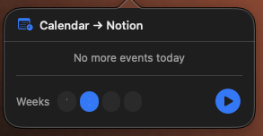
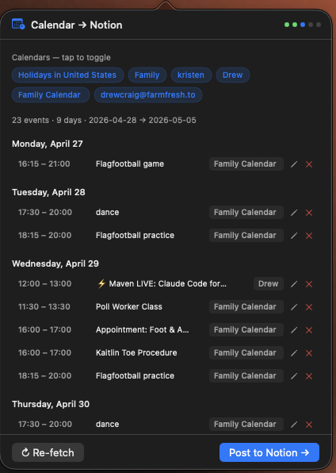
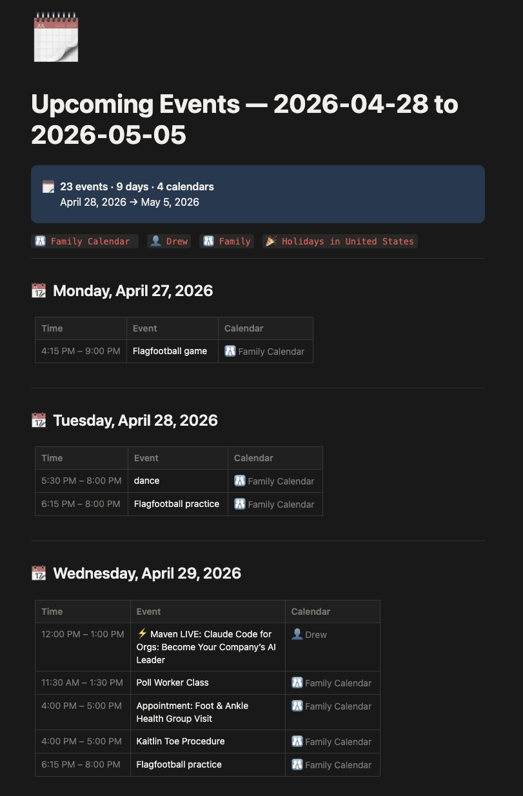

# CalBridge

A native macOS menu bar app that fetches events from all your Google Calendars and posts a formatted weekly schedule to Notion and/or Obsidian — automatically every Sunday night, or on demand.

<br>

<table>
  <tr>
    <td align="center" width="220">
      <br/>
      <sub>Hover to open</sub>
    </td>
    <td align="center" width="280">
      <br/>
      <sub>Preview &amp; edit events</sub>
    </td>
    <td align="center" width="280">
      <br/>
      <sub>Posted to Notion</sub>
    </td>
  </tr>
</table>

<br>

---

## Demo

▶ [Watch the demo on Loom](https://www.loom.com/share/20bf6148ad0d41f1aa7a11e7843245d0)

## Features

- 🗓️ Hover over the menu bar icon — events load instantly from cache
- 🕐 Optional menu bar display of your next upcoming event's time and title
- 📅 Fetches 1 week by default; modify to 1–4 weeks inline
- ✏️ Preview and edit events before posting
- 📝 Posts a beautifully formatted day-by-day table to Notion
- 📓 Obsidian support — sync to your Obsidian vault via Local REST API plugin
- 🔀 Sync target selector — choose Notion, Obsidian, or Both in Settings
- 🗂️ Compact calendar filter dropdown — toggle individual calendars without cluttering the popover
- 🔁 Auto-runs every Sunday at 9 PM via launchd
- ✉️ Email notification on every post (manual and autorun)
- 💾 Persists posted state across relaunches — shows "Open in Notion" or "Open in Obsidian" when already posted
- ✨ Autorun banner shows when the Sunday sync has fired
- ⚠️ Warns if a page for that date range already exists

---

## Install

### Option A — Homebrew (recommended)

```bash
brew tap dkeg/cal-bridge
brew install --cask cal-bridge
```

Then run the setup script:

```bash
./scripts/install.sh
```

### Option B — Direct download

1. Download the latest `CalBridge.dmg` from [Releases](https://github.com/dkeg/cal-bridge/releases)
2. Open the DMG, drag `CalBridge.app` to `/Applications`
3. Clone this repo and run the setup script:

```bash
git clone https://github.com/dkeg/cal-bridge.git
cd cal-bridge
chmod +x scripts/install.sh
./scripts/install.sh
```

---

## Setup

### Prerequisites

- macOS 13+
- Node.js 18+ (`brew install node`)
- A Google account
- A Notion account and/or Obsidian with the Local REST API plugin
- A [Resend](https://resend.com) account (free tier, for email notifications)

### First-time setup

CalBridge includes a built-in setup flow — no terminal or config file editing required.

1. Launch `CalBridge.app` from `/Applications`
2. The setup window appears automatically on first launch
3. Click **Connect with Google** — your browser opens for OAuth authorization
4. Authorize access to Google Calendar
5. Return to the app — it captures the token automatically
6. Enter your Notion integration token (get it at [notion.so/my-integrations](https://notion.so/my-integrations))
7. Click **Finish Setup**

Your credentials are stored securely in macOS Keychain — no `.env` editing needed.

### Notion page setup

1. Go to [notion.so/my-integrations](https://notion.so/my-integrations)
2. Create a new integration → copy the **Integration Token**
3. Open the Notion page you want to post under
4. Click `···` → Connections → connect your integration

### Obsidian setup

1. Install the [Local REST API plugin](https://github.com/coddingtonbear/obsidian-local-rest-api) in Obsidian
2. Copy the API key from the plugin settings
3. Enter it in **Settings → Configuration → Obsidian API Key**
4. Set your vault path and target folder

### Resend (email notifications)

1. Sign up at [resend.com](https://resend.com)
2. Copy your **API Key** from the dashboard
3. Enter it in **Settings → Configuration → Resend API Key**

---

## Usage

1. Launch `CalBridge.app` from `/Applications`
2. Hover over the calendar icon — events load instantly
3. Optionally click **Modify** to change the number of weeks (1–4)
4. Toggle calendars on/off, edit or remove individual events
5. Click **Post to Notion →**, **Post to Obsidian →**, or **Post to Both →** depending on your sync target
6. Button changes to **Open in Notion** or **Open in Obsidian** once posted — persists across relaunches
7. Change sync target anytime in **Settings → General**
8. Enable **Settings → General → Menu bar** to show your next event's time and title next to the icon

---

## Autorun

The app runs automatically every Sunday at 9 PM via a launchd agent. After firing it:
- Writes a flag file to `~/Library/Application Support/CalBridge/last-run.json`
- Sends an email notification to your configured address
- Shows an "Auto-synced" banner the next time you open the popover

To set up or recreate the launchd agent:

```bash
launchctl bootstrap gui/$(id -u) ~/Library/LaunchAgents/com.drewcraig.cal-bridge-autorun.plist
```

To test manually:

```bash
node ~/Projects/cal-bridge/backend/dist/autorun.js
```

---

## Development

```bash
# Clone
git clone https://github.com/dkeg/cal-bridge.git
cd cal-bridge

# Backend
cd backend
cp .env.example .env
# fill in credentials
npm install
npx ts-node auth.ts   # get Google refresh token
npm start             # runs on localhost:8420

# Compile autorun
npx tsc agent.ts autorun.ts --outDir dist --esModuleInterop --resolveJsonModule --module commonjs --target es2020

# Swift app
open CalNotionBar/CalNotionBar.xcodeproj
# Build and run in Xcode (⌘R)
```

### Releasing a new version

```bash
git tag v1.2.0
git push origin v1.2.0
```

GitHub Actions will automatically build the `.dmg` and create a release.

---

## Architecture

```
CalBridge.app (Swift/SwiftUI)
  └── spawns → backend (Express + TypeScript) on localhost:8420
                 ├── /calendars  → Google Calendar API
                 ├── /events     → Google Calendar API
                 ├── /today      → Google Calendar API (badge count)
                 ├── /notion     → Notion API + Resend email
                 └── /obsidian   → Obsidian Local REST API

launchd agent (Sunday 9 PM)
  └── dist/autorun.js
        ├── reads sync target from app plist
        ├── fetches 1 week of events
        ├── posts to Notion and/or Obsidian
        ├── sends email via Resend
        └── writes ~/Library/Application Support/CalBridge/last-run.json
```

---

## Environment Variables

| Variable | Description |
|----------|-------------|
| `GOOGLE_CLIENT_ID` | Google OAuth client ID (Desktop app type) |
| `GOOGLE_CLIENT_SECRET` | Google OAuth client secret |
| `GOOGLE_REFRESH_TOKEN` | Long-lived refresh token (from `auth.ts` or in-app setup) |
| `NOTION_API_KEY` | Notion integration token |
| `NOTION_PARENT_PAGE_ID` | ID of the parent Notion page |
| `RESEND_API_KEY` | Resend API key for email notifications |
| `RESEND_FROM` | Sender address once your domain is verified (default: `onboarding@resend.dev`) |
| `PORT` | Backend port (default: 8420) |

---

## License

MIT
