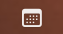

# Cal → Notion

A native macOS menu bar app that fetches events from all your Google Calendars and posts a formatted 2-week schedule to Notion — automatically every Monday, or on demand.



## Features

- 📅 Hover over the menu bar icon to open a compact popover
- 🗓️ Fetches events from all connected Google Calendars
- ✏️ Preview and edit events before posting
- 📝 Posts a beautifully formatted day-by-day table to Notion
- 🔁 Auto-runs every Monday at 7am via launchd
- ⚠️ Warns if a page for that date range already exists

---

## Install

### Option A — Homebrew (recommended)

```bash
brew tap dkeg/cal-notion
brew install --cask cal-notion
```

Then run the setup script:

```bash
cal-notion-setup
```

### Option B — Direct download

1. Download the latest `CalNotion.dmg` from [Releases](https://github.com/dkeg/cal-notion/releases)
2. Open the DMG, drag `CalNotionBar.app` to `/Applications`
3. Clone this repo and run the setup script:

```bash
git clone https://github.com/dkeg/cal-notion.git
cd cal-notion
chmod +x scripts/install.sh
./scripts/install.sh
```

---

## Setup

### Prerequisites

- macOS 13+
- Node.js 18+ (`brew install node`)
- A Google account
- A Notion account

### Google Calendar API

1. Go to [console.cloud.google.com](https://console.cloud.google.com)
2. Create a new project (e.g. "cal-notion")
3. Enable **Google Calendar API** → APIs & Services → Library
4. Create credentials → OAuth 2.0 Client ID → Desktop app
5. Configure OAuth consent screen → External → add yourself as a test user
6. Copy your **Client ID** and **Client Secret**

### Notion Integration

1. Go to [notion.so/my-integrations](https://notion.so/my-integrations)
2. Create a new integration → copy the **Integration Token**
3. Open the Notion page you want to post under
4. Click `···` → Connections → connect your integration
5. Copy the **Page ID** from the page URL (the 32-char string after the last `/`)

### Run setup

```bash
./scripts/install.sh
```

The script will:
- Install Node dependencies
- Collect your credentials and write `.env`
- Open a browser for Google OAuth (gets your refresh token)
- Optionally set up the weekly Monday auto-run

---

## Usage

1. Launch `CalNotionBar.app` from `/Applications`
2. Hover over the calendar icon in your menu bar
3. Select how many weeks ahead (1–4)
4. Click ▶ to fetch and preview events
5. Toggle calendars, edit or remove individual events
6. Click **Post to Notion →**

---

## Development

```bash
# Clone
git clone https://github.com/dkeg/cal-notion.git
cd cal-notion

# Backend
cd backend
cp .env.example .env
# fill in credentials
npm install
npx ts-node auth.ts   # get Google refresh token
npm start             # runs on localhost:8420

# Swift app
open CalNotionBar/CalNotionBar.xcodeproj
# Build and run in Xcode
```

### Releasing a new version

```bash
git tag v1.0.1
git push origin v1.0.1
```

GitHub Actions will automatically build the `.dmg` and create a release.

---

## Architecture

```
CalNotionBar.app (Swift/SwiftUI)
  └── spawns → backend (Express + TypeScript)
                 ├── /calendars  → Google Calendar API
                 ├── /events     → Google Calendar API
                 ├── /today      → Google Calendar API
                 └── /notion     → Notion API
```

---

## Environment Variables

| Variable | Description |
|----------|-------------|
| `GOOGLE_CLIENT_ID` | Google OAuth client ID |
| `GOOGLE_CLIENT_SECRET` | Google OAuth client secret |
| `GOOGLE_REFRESH_TOKEN` | Long-lived refresh token (from `auth.ts`) |
| `NOTION_API_KEY` | Notion integration token |
| `NOTION_PARENT_PAGE_ID` | ID of the parent Notion page |
| `PORT` | Backend port (default: 8420) |

---

## License

MIT
